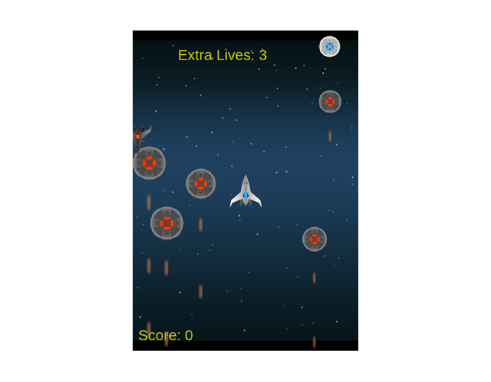

# Space Shooter



### Built With
This project was built using these technologies.

* Javascript
* Webpack
* VSCode
* ESLint
* Phaser3
* HTML5
* Jest

### About the game

The design of the game was mainly decided with the phaser3 space shooter tutorial. The design was expanded to have more than one live and save the score of game.

### Design

this is a simple pixel game made using low-quality version ships and assets from the page.

our player is a starship  that most defeat enemies by shooting them lasers .

in this game we have to face 3 kinds of enemies which are the following:

* A chaser ship that follows the player when it gets to close .
* An evil dark ufo, who will constantly shoot at you . Be careful of their lasers 
* An enemy starship that does not shoot but will hurt the player if you crash with it

### Future Features

* add more enemies
* save the score online
* make the game more difficult as the game progresses
* separate ES6 modules

### Live Demo

[Live Demo Link](https://jvcapstone.herokuapp.com/)

### Running Locally

Clone the repo:
```
git clone https://github.com/ricardo123321/JavaScripts-Capstone.git
```
Inside the root folder of the project, install the node packages:
```
npm install
```
Go to the root folder and run the npm build script:
```
npm run start
```
### How to play
In this game you have to shoot the enemy ships to earn points while avoiding them and their lasers, the objective of this game is to accumulate the biggest quantity of points before being destroyed.

to controls are: W(move up), S(move down), D(move rigth), A(move left), Space(shoot)

## Author

👤 Ricardo

- Github: [@ricardo123321](https://github.com/ricardo123321)

## 🤝 Contributing

Contributions, issues and feature requests are welcome!

Feel free to check the [issues page](issues/).

## Show your support

Give a ⭐️ if you like this project!

## Acknowledgments

- Thanks to Microverse and the wonderful reviewers who have guided us to the completion of this project
- CruzR: The creator of the assets used


## 📝 License

This project is [MIT](lic.url) licensed.
 
